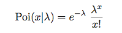
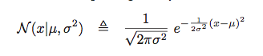
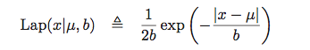
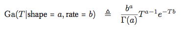
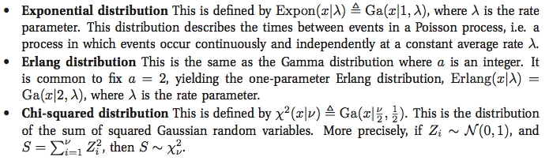
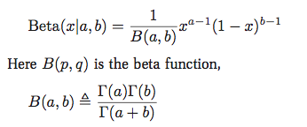

title: "Probability温习"
---

# Probability温习

Types of machine learning：

Supervised learning：Classification，Regression

Unsupervised learning：Discovering clusters(k-means)，Discovering latent factors(PCA)，Discovering graph structure，Matrix completion，

Some basic concepts：

parametric model：the model have a fixed number of parameters。e.g. Logistic regression
non-parametric model：the number of parameters grow with the amount of training data。e.g. k-nearest neighbors(将面临维度灾难)

The curse of dimensionality：用来描述当（数学）空间维度增加时，分析和组织高维空间（通常有成百上千维），因体积指数增加而遇到各种问题场景。这样的难题在低维空间中不会遇到，如物理空间通常只用三维来建模。举例来说，100个平均分布的点能把一个单位区间以每个点距离不超过0.01采样；而当维度增加到10后，如果以相邻点距离不超过0.01小方格采样一单位超正方体，则需要1020 个采样点:所以，这个10维的超正方体也可以说是比单位区间大1018倍。(这个是Richard Bellman所举的例子)。

probability mass function，i.e. 概率分布函数，针对离散随机变量。
probability density function，i.e. 概率密度函数，针对连续随机变量。

概念：cumulative distribution function，probability density function，quantile(分位点)。具体请参考下图：

### discrete distributions

binomial distribution:

multinomial distribution:

Poisson distribution：

### continuous distributions

Gaussian (normal) distribution:

Student t distribution:

Laplace distribution:

Outliers对Gaussian,Student,Laplace的影响：

gamma distribution:

Three distribution:

beta distribution:

