title: "Aggregation模型"
---

# Aggregation模型(集成学习)

#### author: vincentyao@tencent.com

写下这个主题文章，主要受到两个事情的启发：(1)同事kimmyzhang对[GBDT的分享](http://pan.baidu.com/s/1jGjAvhO)；(2)陈天奇的[xgboost](https://github.com/dmlc/xgboost) 开始被我们在实际工作中使用。以前对GBDT为代表的aggregation模型或多或少也有一些理解，但知识体系感不强，所以下面的文章主要是从体系角度梳理一下aggregation模型相关的内容。在梳理的过程中，参考了很多现有的资料，譬如kimmyzhang的分享ppt，陈天奇的ppt，林轩田老师的课程等，具体请见文末的参考文献，在此对这些作者表示感谢。

## 开篇

Aggregation模型，即融合式的模型，也叫Ensemble Learning。那什么是Aggregation模型呢？通俗的讲，就是多算法融合。它的思想用一句俗语概括：三个臭皮匠，顶个诸葛亮。实际操作中，Aggregation模型把大大小小的多种算法融合在一起，共同协作来解决一个问题。这些算法可以是不同的算法，也可以是相同的算法。

根据融合的方式，我们可以将Aggregation模型分为三种：(1)Uniform，将多个模型平均的合并在一起；(2)Linear组合，将多个模型利用linear model融合起来；(3)Conditional，不同的情形使用不同的模型，即将多个模型利用non-linear model融合起来。

在下文中，我们用g_t 表示第t个单模型，Aggregation model所要做的就是把多个g_t 融合起来。而融合的过程，我们又可以分为两类：(1)Blending，已知多个g_t，再将多个g_t 融合起来，即aggregation after getting g_t；(2)Learning: 一边学习g_t，一边合并多个g_t，即aggregation as well as getting g_t。

所以，对Aggregation模型基本的划分，则如下表所示。其中，对每一种融合类型，都列举了一种典型的Aggregation模型。

| Aggregation Type | Blending(已知g，再融合多个g)  | Learning(一边学习g，一边融合多个g)  |
| ------------- |:-------------:| -----:|
| uniform     | voting/averaging | Bagging |
| non-uniform     | linear      |   AdaBoost，GradientBoost |
| conditional | stacking(non-linear)     |    Decision Tree |

---

有了多种Aggregation模型后，还可以将Aggregation模型再融合。如果将bagging配上decision tree，则是random forest。如果将AdaBoost配上Decision Tree，则是AdaBoost-DTree。如果将GradientBoost配上Decision Tree，则是大名鼎鼎的GBDT(Gradient Boost Decision Tree)。

OK，对Aggregation模型有了大体的认识后，下文将来讲述一些具有代表性的Aggregation模型。本文大致分为六个部分：第一部分简要介绍有监督学习；第二部分介绍Decision Tree；第三部分介绍Random forest；第四部分介绍AdaBoost；第五部分介绍Gradient Boost Decision Tree；最后对Aggregation模型做一下对比与总结。

## Supervised Learning基础
先介绍一些Supervised Learning的基础知识。

首先是模型。

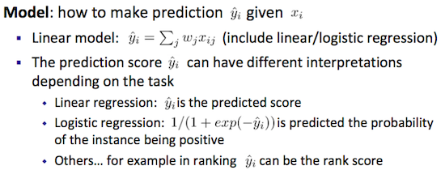

其次是loss function和regularization。

将loss function和regularization合到一起，就是一些常见的有监督模型：Logistic regression，lasso等。

## Decision Tree(决策树)

按照Aggregation的方式，可以将决策树的表达式写为：

$$G(x)=\sum_{t=1}^T{q_t(x).g_t(x)}$$

g_t表示一个base hypothesis，在决策树里，也就是每条路径的叶子节点。q_t表示条件，表示输入x 是不是在path t上。下图是一个决策树的例子，图中有5个叶子节点，则有5个g_t。通常情况下，我们都用递归形式来表示一个决策树。

根据决策树的输出y的类型，可以将decision tree分为：分类树和回归树。

- 分类树：预测分类标签；
- 回归树：预测实数值；回归树的结果是可以累加的；即regression tree is a function that maps the attributes to the score。

另一种decision tree的表示方法如下所示：

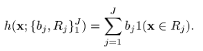

其中，该树有J个叶子节点，Rj 表示x的一个分离区域，1(.) 是indicator function。
b_j 是base learner的参数，如果是classification tree，则是该叶子节点的类目；如果是regression tree，则有 \\(b_j = ave_{x_i \in R_j} {y_i}\\)。决策树可以简单表述为：if \\(x \in R_j\\)，then \\(h(x)=b_j\\)。

一棵树的训练过程为：根据一个指标，分裂训练集为几个子集。这个过程不断的在产生的子集里重复递归进行，即递归分割。当一个训练子集的类标都相同时递归停止。这种决策树的自顶向下归纳(TDITD) 是贪心算法的一种，也是目前为止最为常用的一种训练方法，但不是唯一的方法。

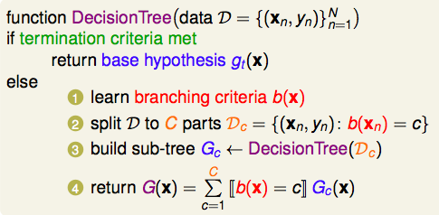

从decision tree的训练过程可以看到，训练的关键点是branching(即在每一步选择一个最好的属性来分裂)。那如何branching呢，通常的做法是：Split training set at "the best value" of "the best feature"。"最好"的定义是使得子节点中的训练集尽量的纯，不同的算法使用不同的指标来定义"最好"。

- Information gain (ratio)：信息增益是用来衡量样本集S下属性A分裂时的信息熵减少量。信息增益是信息熵的有效减少量，值越高，说明失去的不确定性越多，那么它就应该越早作为决策的依据属性。例如ID3, C4.5 和 C5.0算法。
- Gini index：基尼不纯度表示一个随机选中的样本在子集中被分错的可能性。基尼不纯度为这个样本被选中的概率乘以它被分错的概率。当一个节点中所有样本都是一个类时，基尼不纯度为零。例如CART算法。

### CART

CART全称"Classification and Regression Tree"，是一种较常用的决策树。为了简化决策过程，它有两个基本选择：(1)二叉树；(2)g_t(x)输出是一个常数。

CART的branch利用Impurity function来衡量。如果目标是回归，利用regression error作为Impurity function。如果目标是分类，利用Gini index作为impurity function。

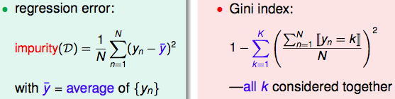

利用[利用信息增益，决策树算法的计算过程演示](http://mydisk.com/yzlv/webpage/datamining/xiti.html)的例子，如果采用Gini系数的话，计算过程为：

> 按性别属性变量进行分裂。9/20*(1- (6/9)^2 - (3/9)^2) + 11/20*(1- (7/11)^2 - (4/11)^2) = 0.4545。

> 按车型变量进行分裂(运动 vs 豪华+家用)。9/20*(1- (1/9)^2 - (8/9)^2) + 11/20*(1 - (11/11)^2) = 0.088。

CART的termination条件是：

所以，总结下来，CART是：fully-grown tree with constant leaves that come from bi-branching by purifying。

关于CART算法的演算过程，可以参考：[An example of calculating gini gain in CART](http://www.academia.edu/7032069/An_example_of_calculating_gini_gain_in_CART)

一个fully-grown的CART，在训练数据上可以做到无差错(即Ein=0)，但这样往往是过拟合的。所以需要regularizer，通常的方法是：限制叶子节点的个数。

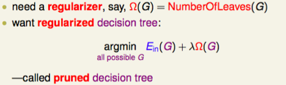

### Decision tree小结

Regularization方法：

>(1)Number of nodes in the tree, depth；(2)L2 norm of the leaf weights

决策树的流程(From heuristics view)：

>(1)Split by information gain；(2)Prune the tree；(3)Maximum depth；(4)Smooth the leaf values

决策树的流程(From objective optimization view)：

>(1)Information gain -> training loss；(2)Pruning -> regularization defined by #nodes；(3)Max depth -> constraint on the function space；(4)Smoothing leaf values -> L2 regularization on leaf weights

Decision tree优点：

>(1)易于理解和解释；(2)即可以处理数值型数据也可以处理类别型数据；(3)生成的模式简单，对噪声数据有很好的健壮性。

Decision tree缺点：

>(1)启发式的规则(前人的巧思)，缺乏理论基础，并且启发式规则很多，需要selection；(2)容易过拟合；(3)对那些有类别型属性的数据, 信息增益会有一定的偏置；(4)训练一棵最优的决策树是一个完全NP问题。

几种决策树算法的区别：

>ID3算法使用信息增益。C4.5算法是在ID3算法的基础上采用**信息增益率**的方法选择测试属性。ID3算法和C4.5算法虽然在对训练样本集的学习中可以尽可能多地挖掘信息，但其生成的决策树分支较大，规模较大。

>为了简化决策树的规模，提高生成决策树的效率，所以有了根据GINI系数来选择测试属性的决策树算法CART。
>CART算法采用一种二分递归分割的技术，与基于信息熵的算法不同，CART算法对每次样本集的划分计算GINI系数，GINI系数，GINI系数越小则划分越合理。CART算法总是将当前样本集分割为两个子样本集，使得生成的决策树的每个非叶结点都只有两个分枝。因此CART算法生成的决策树是结构简洁的二叉树。

更多参考资料

- [使用ID3算法构造决策树](http://www.raychase.net/1275)
- [C4.5& CART](http://www.raychase.net/1951)
- [Decision Trees Tutorial by Andrew Moore](http://www.autonlab.org/tutorials/dtree.html)
- [Wiki: Decision tree learning](http://en.wikipedia.org/wiki/Decision_tree_learning)
- [Machine Learning: Decision Trees.CS540](http://pages.cs.wisc.edu/~jerryzhu/cs540/handouts/dt.pdf)

## Random forest

### Bagging

开篇里已经简要介绍过uniform aggregation。在uniform融合过程中，diversity非常重要，可以利用多个不同的模型，可以用一个模型但不同的参数，可以采用不同的随机值初始化模型，可以随机抽样数据来训练多个模型。

Bagging(也称bootstrap aggregation)是一种基于data randomness的uniform的融合方式。
bootstrapping指从给定训练集中有放回的均匀抽样。

Uniform blending有一个好的特性，它可以降低模型的variance。

### Random forest

Bagging方法通过voting可以减小variance，而decision tree具有良好的bias表现，但有large variance(特别是fully-grown DTree)。所以一个直观的想法，能否将Bagging和Decision Tree这两者融合在一起，这样得到的新模型则具备了相对良好的bias和variance表现，这就是Random forest。

random forest(RF)的算法描述如下：

Bagging是data randomness，而为了增强diversity(即得到更多不同的g_t)，还可以对建立decision tree的features做抽样，即random subspace。该思想也可以套用在其他模型上(譬如svm，lr)。

在build decision tree时，每一次做branch的时候，都可以做一次random re-sample feature，这样可以让g_t 更不一样。

除此外，还可以利用random combination，也就是在branching时，不仅仅只是随机选择一个feature做切分，还可以random多个feature，将feature做linear combination后，再来做切分。random combination理论上就是一个perceptron过程。

所以，Random forest是bagging + random-subspace & random-combination CART，可以看到randomness思想在random forest里无处不在。

回顾一下bagging的过程，每次随机抽样一些数据，这样下去，总会有一些样本是一直未被抽中的，这些样本我们称之为out-of-bag examples，它们可以被当作validation set来使用。所以，random forest的另一个重要特性是：相比于通常的validation过程，RF可以做self-validation，也就是在训练的过程中，把model选择顺便也做了。

## AdaBoost

### Boosting

Boosting的思想相当的简单，对一份数据，建立M个模型（比如分类），一般这种模型比较简单，称为弱分类器(weak learner)。每次分类都将上一次分错的数据权重提高一点再进行分类，这样最终得到的分类器在测试数据与训练数据上都可以得到比较好的成绩。Boosting也就是开篇所述的linear blending模型。

boosting可以用下面公式来表示：

其中alpha是权重，y_m是弱分类器，整体就是一个linear模型。

从Function Space里的Numerical Optimization角度看Boosting。boosting也叫forward stagewise additive modeling，因为在迭代的过程中，我们不能再回退去修改以前的参数，一切只能向前看了。

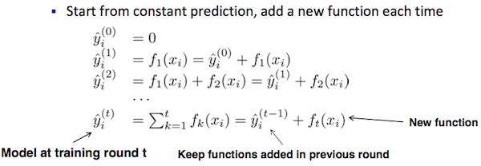

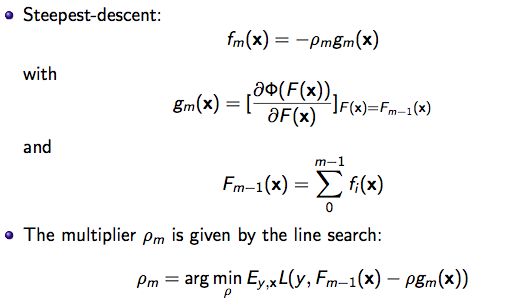

不同的损失函数和极小化损失函数方法决定了boosting的最终效果，先说几个常见的boosting：

上图出自 Machine Learning A Probabilistic Perspective Table 16.1(P556)。不过其中注释的algorithm和个人理解有些不一致，Absolute error应该是叫Least Absolute Deviation (LAD) Regression。Gradient boosting的常见示例是squared loss。

Boosting方法共性：

- Train one base learner at a time
- Focus it on the mistakes of its predecessors
- Weight it based on how 'useful' it is in the ensemble (not on its training error)

更多请参考：[Introduction to Boosting](http://www.cs.man.ac.uk/~stapenr5/boosting.pdf)

### AdaBoost
AdaBoost(Adaptive Boosting)由Yoav Freund和Robert Schapire提出。AdaBoost方法的自适应在于：前一个分类器分错的样本会被用来训练下一个分类器。AdaBoost方法对于噪声数据和异常数据很敏感。但在一些问题中，AdaBoost方法相对于大多数其它学习算法而言，不会很容易出现过拟合现象。

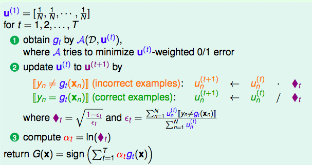

AdaBoost方法是一种迭代算法，在每一轮中加入一个新的弱分类器，直到达到某个预定的足够小的错误率。每一个训练样本都被赋予一个权重，表明它被某个分类器选入训练集的概率。如果某个样本点已经被准确地分类，那么在构造下一个训练集中，它被选中的概率就被降低；相反，如果某个样本点没有被准确地分类，那么它的权重就得到提高。

通过这样的方式，AdaBoost方法能“聚焦于”那些较难分（更富信息）的样本上。在具体实现上，最初令每个样本的权重都相等，对于第k次迭代操作，我们就根据这些权重来选取样本点，进而训练分类器g_k。然后就根据这个分类器，来提高被它分错的的样本的权重，并降低被正确分类的样本权重。然后，权重更新过的样本集被用于训练下一个分类器g_k。整个训练过程如此迭代地进行下去。

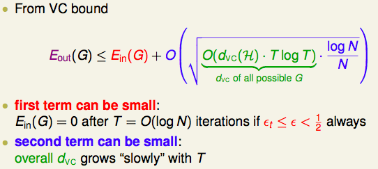

AdaBoost方法中使用的分类器可能很弱（比如出现很大错误率），但只要它的分类效果比随机好一点（比如两类问题分类错误率略小于0.5），就能够改善最终得到的模型。而错误率高于随机分类器的弱分类器也是有用的，因为在最终得到的多个分类器的线性组合中，可以给它们赋予负系数，同样也能提升分类效果。

### AdaBoost-DTree
将AdaBoost和decision tree融合起来，就是AdaBoost-DTree，如下图所示：

在AdaBoost模型中，需要给予不同样本不同的权重。如果模型是svm或lr的话，很容易把weight加到每个instance上，只需要在计算loss function的时候，乘上相应的weight系数即可。

但在AdaBoost-DTree模型中，对于DTree，不方便赋予weight给不同样本。这时可以利用bootstrap的思想。

Bootstrap，它在每一步迭代时不改变模型本身，而是从N个instance训练集中按随机抽取N个instance出来（单个instance可以被重复sample），对着这N个新的instance再训练一轮，由于数据集变了迭代模型训练结果也不一样。

在AdaBoost-DTree模型做样本抽样时，并不是Uniform抽样，而是根据一定概率来抽样。如果一个instance在前面分错的越厉害，它的概率就被设的越高，这样就能同样达到逐步关注被分错的instance，逐步完善的效果。

### Optimization视角看AdaBoost

从前述AdaBoost的训练过程，可以得到其训练目标为：让正确instance的weight越来越小，正确的instance个数越多越好。

那么其最终目标为：第T次训练时，所有instance的weight之和最小。写出其Error function为：

从上面的优化目标，可以得到AdaBoost的loss function是exponential loss。

为什么选择Exponential Loss？

- Loss is higher when a prediction is wrong.
- Loss is steeper when a prediction is wrong.
- Precise reasons later

求解AdaBoost的优化目标，得到下一个h(x_n)即为A(base algorithm)，h上的权重即为a_t。

具体的推导过程参考"机器学习技法"课程，这里不赘述了。总结下来，AdaBoost：steepest decent with approximate functional gradient。

## GBDT

### GradientBoost

前面已经对boost方法做了一些介绍，这里再针对GradientBoost从公式推导角度再做更细致的介绍。

首先GradientBoost如所有boost方法一样，可以将最终模型表达式写为：

对于有限的训练样本 \\({[y_i,x_i]}_1^N\\)，下式是我们要优化的目标：

因为boost是一种stagewise additive方法，对于其每一次迭代，m=1,2 ... M，优化目标为：

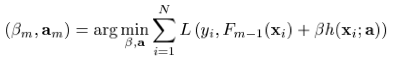

直接求解上面的目标函数会比较复杂。所以，我们换个思路，考虑到通常情况下，梯度下降方向是一个合理的优化方向，那么我们可以先求出m-1时的负梯度方向 -g，然后尽可能把h(x)往 -g 方向上拟合。所以有：

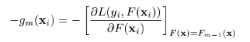

那么第m次迭代计算后，得到的模型为：

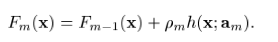

将上面的计算过程整体串起来，则有：

Gradient Boosting是一种Boosting的方法。与传统的Boost的区别是，每一次的计算是为了减少上一次的残差(residual)，而为了消除残差，我们可以在残差减少的梯度(Gradient)方向上建立一个新的模型。所以说，在Gradient Boost中，每个新的模型的建立是为了使得之前模型的残差往梯度方向减少，与传统Boost对正确、错误的样本进行加权有着很大的区别。

GradientBoost: allows extension to different err for regression/soft classification/etc。

如果整体loss function取squared error，即L(y,F) = (y - F)^2 / 2。此时，我们得到Least-squares regression。

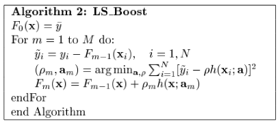

如果整体loss function取absolute error，即L(y,F) = |y - F|。此时有：

更多请参考[Greedy Function Approximation: A Gradient Boosting Machine](http://docs.salford-systems.com/GreedyFuncApproxSS.pdf)，[模型组合(Model Combining)之Boosting与Gradient Boosting](http://www.cnblogs.com/LeftNotEasy/archive/2011/01/02/machine-learning-boosting-and-gradient-boosting.html)

### Gradient boost decision tree
GBDT(Gradient boost decision tree)，又叫MART(Multiple Additive Regression Tree)。目前GBDT有两个不同的描述版本。[残差版本](http://hi.baidu.com/hehehehello/item/96cc42e45c16e7265a2d64ee)把GBDT当做一个残差迭代树，认为每一棵回归树都在学习前N-1棵树的残差。[Gradient版本](http://blog.csdn.net/dark_scope/article/details/24863289)把GBDT说成一个梯度迭代树，使用梯度下降法求解，认为每一棵回归树在学习前N-1棵树的梯度下降值。这两种描述版本我认为是一致的，因为损失函数的梯度下降方向，就是残差方向。

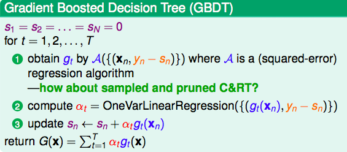

Gradient Boosting Machine：

GB+DT+squared error loss：

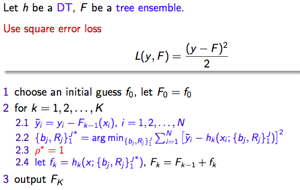

更多请参考：[GBDT迭代决策树](http://www.360doc.com/content/14/1205/20/11230013_430680346.shtml)，[kimmyzhang-GBDT]()。

### Regularization
GBDT的常见regularization方法有：控制树的个数(即early stop)，控制每一棵树的复杂度。

而控制一棵树的复杂度，可以控制树的深度，叶子节点个数，以及叶子节点的weight。如下式所示：

除此外，还可以在每次训练树时，对data和feature做subsampling。

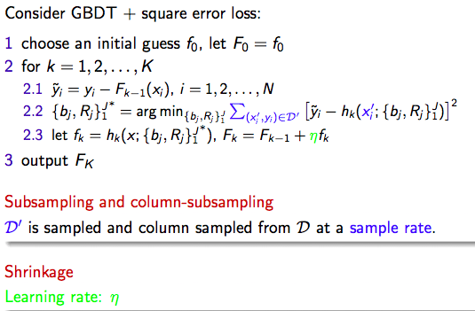

另一个常见的正则方法是Shrinkage。Shrinkage（缩减）的思想认为，每次走一小步逐渐逼近结果的效果，要比每次迈一大步很快逼近结果的方式更容易避免过拟合。即它不完全信任每一个棵残差树，它认为每棵树只学到了真理的一小部分，累加的时候只累加一小部分，通过多学几棵树弥补不足。This means we do not do full optimization in each step and reserve chance for future rounds, it helps prevent overfitting。

### GBDT应用
如果想通过代码学习GBDT，可以参考code：[kaggle-2014-criteo my notes](https://github.com/zzbased/kaggle-2014-criteo)，[陈天奇的xgboost](https://github.com/dmlc/xgboost)。

在xgboost中，GBDT的编码实现步骤为：

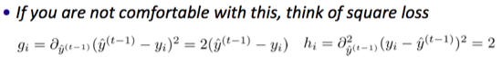
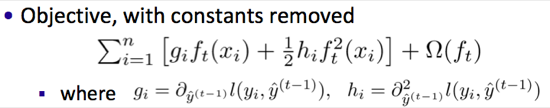

相比于gbdt的常见算法，为什么要推导出上面优化目标，主要原因为Engineering benefit。

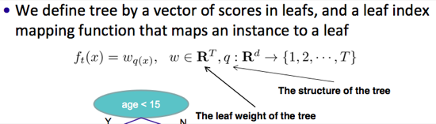

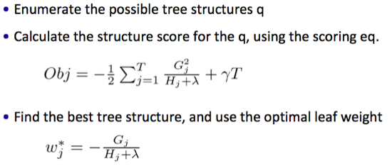
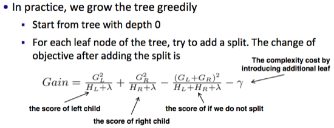

最近，gbdt模型在搜索排序里得到大量应用。除此外，GBDT还可以用来做特征选择和特征组合。

特征选择，参考[Feature Importance Analysis with XGBoost in Tax audit](http://fr.slideshare.net/MichaelBENESTY/feature-importance-analysis-with-xgboost-in-tax-audit)

特征组合里，比较有代表性的是facebook的文章
[Practical Lessons from Predicting Clicks on Ads at Facebook](http://quinonero.net/Publications/predicting-clicks-facebook.pdf)提到的方法，它利用GBDT+LR做CTR预估，取得不错的效果。

## 总结

### Aggregation方法总结
**Blending Models**

blending: aggregate after getting diverse g_t

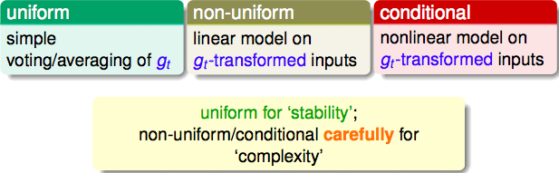

**Aggregation-Learning Models**

learning: aggregate as well as getting diverse g_t

**Aggregation of Aggregation Models**

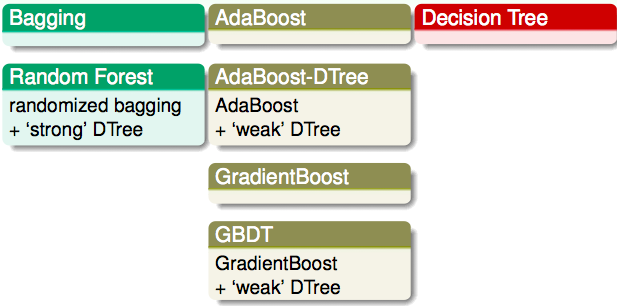

**为什么Aggregation方法是有效的？**

可以从两方面来看，其一通过Aggregation可以生成复杂的hypotheses，相当于做了feature transform；其二，生成的G(x)更加moderate，例如下图中PLA的uniform mix就是large-margin，相当于做了regularization。

### Boosting方法比较

关于boosting方法的比较，上文中mlapp的图已经表达得比较明确了。这里再在公式上做一下细化。

Square and Absolute Error：

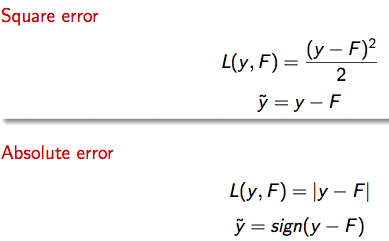

Logistic Loss and LogitBoost：

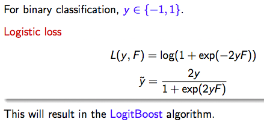

Exponential Loss and Adaboost：

下面把一些常见方法的特点再加强阐述下。

- Adaboost：一种boost方法，它按分类对错，分配不同的weight，计算cost function时使用这些weight，从而让“错分的样本权重越来越大，使它们更被重视”。

- GBDT的核心在于：每一棵树学的是之前所有树的结论和残差。每一步的残差计算其实变相地增大了分错instance的权重，而已经分对的instance则都趋向于0。

- Bootstrap，它在每一步迭代时不改变模型本身，也不计算残差，而是从N个instance训练集中按一定概率重新抽取N个instance出来（单个instance可以被重复sample），对着这N个新的instance再训练一轮，由于数据集变了迭代模型训练结果也不一样。

	如果一个instance被前面分错的越厉害，它的概率就被设的越高，这样就能同样达到逐步关注被分错的instance，逐步完善的效果。这里是决策树给予不同样本不同权重的方法。

### 一篇不错的综述性文章：[集成学习：机器学习刀光剑影之屠龙刀](http://www.52cs.org/?p=383)

- Bagging和boosting也是当今两大杀器RF（Random Forests）和GBDT（Gradient Boosting Decision Tree）之所以成功的主要秘诀。
- Bagging主要减小了variance，而Boosting主要减小了bias，而这种差异直接推动结合Bagging和Boosting的MultiBoosting的诞生。参考:Geoffrey I. Webb (2000). MultiBoosting: A Technique for Combining Boosting and Wagging. Machine Learning. Vol.40(No.2)
- LMT(Logistic Model Tree ) 应运而生，它把LR和DT嫁接在一起，实现了两者的优势互补。对比GBDT和DT会发现GBDT较DT有两点好处：1）GBDT本身是集成学习的一种算法，效果可能较DT好；2）GBDT中的DT一般是Regression Tree，所以预测出来的绝对值本身就有比较意义，而LR能很好利用这个值。这是个非常大的优势，尤其是用到广告竞价排序的场景上。
- 关于Facebook的GBDT+LR方法，它出发点简单直接，效果也好。但这个朴素的做法之后，有很多可以从多个角度来分析的亮点：可以是简单的stacking，也可以认为LR实际上对GBDT的所有树做了选择集成，还可以GBDT学习了基，甚至可以认为最后的LR实际对树做了稀疏求解，做了平滑。

## 更多学习资料
- [Gbdt迭代决策树入门教程](http://suanfazu.com/t/gbdt-die-dai-jue-ce-shu-ru-men-jiao-cheng/135)
- [Boosting Decision Tree入门教程](http://www.schonlau.net/publication/05stata_boosting.pdf)
- [LambdaMART用于搜索排序入门教程](http://research.microsoft.com/pubs/132652/MSR-TR-2010-82.pdf)
- [文章 Ask a Data Scientist: Ensemble Methods](http://insidebigdata.com/2014/12/18/ask-data-scientist-ensemble-methods/) - [决策树模型组合之随机森林与GBDT](http://cvchina.net/post/107.html)
	[机器学习中的算法(1)-决策树模型组合之随机森林与GBDT link2](http://www.cnblogs.com/LeftNotEasy/archive/2011/03/07/random-forest-and-gbdt.html)
- [xgboost - eXtreme Gradient Boosting (GBDT or GBRT) Library](https://github.com/tqchen/xgboost), also support distributed learning。并行实现推荐 @陈天奇怪 的xgboost，实际例子见@phunter_lau 最近的文章 http://t.cn/RhKAWac
- [pGBRT: Parallel Gradient Boosted Regression Trees](http://machinelearning.wustl.edu/pmwiki.php/Main/Pgbrt)
- [更多GBDT](http://bigdata.memect.com/?tag=GBDT)
- [决策树 用Python实现了决策树的ID3生成算法和C4.5生成算法](http://www.hankcs.com/ml/decision-tree.html)
- [论文 Understanding Random Forests: From Theory to Practice](http://t.cn/RZBT6Ap)
Louppe, Gilles的博士论文，全面了解随机森林的好材料。[pdf](http://t.cn/RZBTobH)
- [Interpreting random forests](http://blog.datadive.net/interpreting-random-forests/)
- [计算机视觉：随机森林算法在人体识别中的应用](http://toutiao.com/a4055188882/)
- [机器学习技法课程](https://zh.coursera.org/course/ntumltwo)
- [J. Friedman(1999). Greedy Function Approximation: A Gradient Boosting Machine](http://statweb.stanford.edu/~jhf/ftp/trebst.pdf)
- J. Friedman(1999). Stochastic Gradient Boosting.
- J. Friedman, T. Hastie, R. Tibshirani(2000). Additive Logistic Regression - A Statistical View of Boosting.
- T. Hastie, R. Tibshirani, J. Friedman(2008). Chapter 10 of The Elements of Statistical Learning(2e).
- [GBDT的分享-by kimmyzhang](http://pan.baidu.com/s/1jGjAvhO)
- [Boosted Tree - by 陈天奇](http://www.52cs.org/?p=429)
